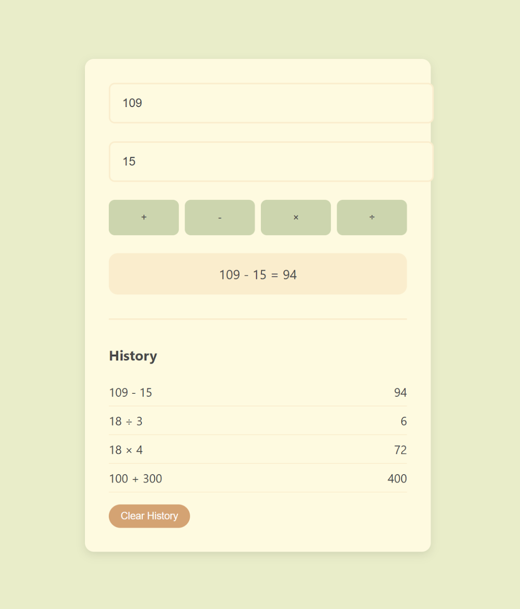

# PHP Calculator 🧮

A modern web-based calculator built with PHP featuring basic arithmetic operations, calculation history, and an earthy color palette.



## Features ✨

- **Basic Operations**
  - Addition (+), Subtraction (-)
  - Multiplication (×), Division (÷)
- **Calculation History**
  - Last 5 calculations stored in session
  - Clear history button
- **Modern Interface**
  - Responsive design
  - Earth tone color scheme
  - Smooth animations
- **Security Features**
  - CSRF protection
  - Input validation
  - Error handling
- **Accessibility**
  - Keyboard support (+, -, *, /)
  - ARIA labels
  - Mobile-friendly

## Installation 💻

1. **Requirements**
   - PHP 8.0+
   - Web server (or PHP built-in server)

2. **Quick Start**
   ```bash
   git clone https://github.com/your-username/php-calculator.git
   cd php-calculator
   php -S localhost:8000
   Open http://localhost:8000 in your browser

## Color Palette 🎨
Earth Tone Theme:
```bash
Primary: #CCD5AE (Sage Green) - Buttons
Background: #E9EDC9 (Light Green) - Page background
Surface: #FEFAE0 (Cream) - Calculator body
Secondary: #FAEDCD (Beige) - Input borders
Accent: #D4A373 (Terracotta) - Errors/Clear button
```
## Technical Details 🔧
- PHP Features
- Session management
- CSRF token validation
- Error handling with exceptions
- Frontend
- CSS Grid/Flex layouts
- CSS Custom Properties
- Responsive design
- Progressive enhancement
- Security
- Input sanitization
- POST method for all operations
- Session-based history storage

## Usage Example 📝
```bash
Enter two numbers
Click any operation button:
+ Add numbers
- Subtract numbers
× Multiply numbers
÷ Divide numbers
View results below
History automatically updates
Use keyboard shortcuts for operations
```
## Acknowledgements 🙏
- PHP documentation
- Modern CSS practices
- Web security best practices
- Clean code principles

License 📄
MIT License - See LICENSE file
